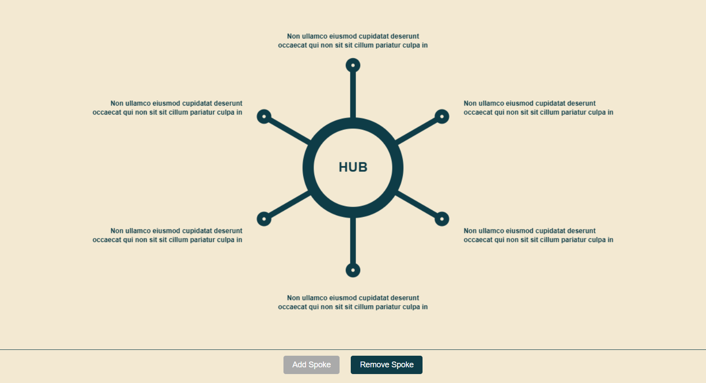
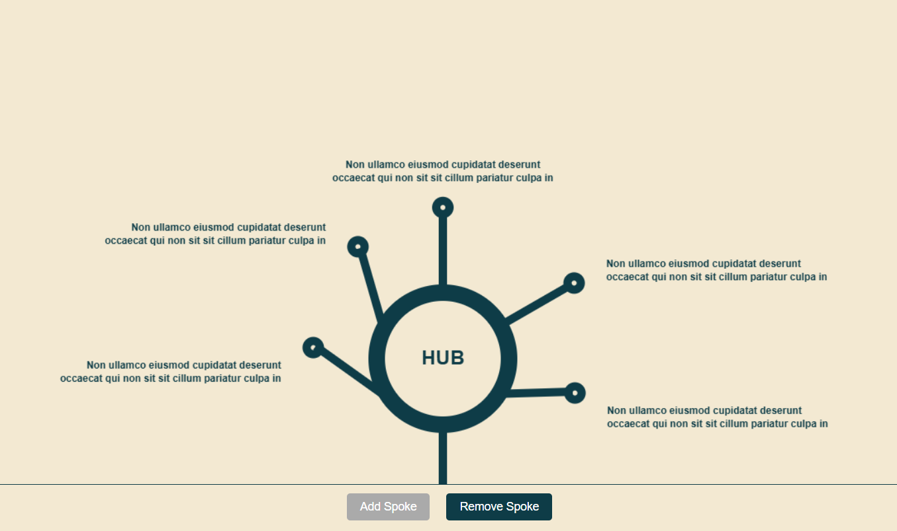

# How to run?
I used React inside an HTML template. 
Just download the HTML files, open them in the editor, and run them using a live server.

### There are two files:

1. final.html: Contains all the required implementation except text overlapping.
2. text_overlapping.html: Contains all required implementation.

